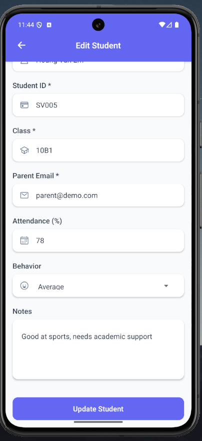

# eduTrack - Student Progress Tracker

A comprehensive mobile application for managing student academic progress, facilitating communication between teachers and parents, and providing real-time insights into student performance.

## Project Overview

eduTrack is a digital gradebook and communication platform that modernizes the traditional student-parent-teacher interaction. Built with React Native and Node.js, it provides a seamless experience for tracking academic progress, managing student data, and maintaining transparent communication.

### Key Features

- **Multi-Role Authentication**: Separate interfaces for Teachers and Parents
- **Student Management**: Complete CRUD operations for student profiles
- **Grade Tracking**: Comprehensive grading system with visual analytics
- **Real-Time Notifications**: Instant updates on student progress
- **Progress Analytics**: Interactive charts showing academic trends
- **Attendance Monitoring**: Track and visualize attendance patterns
- **Behavior Assessment**: Monitor and record student behavior

## Demo Screenshots

### Login Screen
<p align="center">
  
</p>

### Register Screen
<p align="center">
  
</p>

### Dashboard - Teacher
<p align="center">
  
</p>

### Student List
<p align="center">
  
</p>

### Student Detail
<p align="center">
  
  
</p>

### Add New Grade Modal
<p align="center">
  
</p>

### Edit Students
<p align="center">
  
</p>

### Notifications - Teacher
<p align="center">
  
</p>

### Compose Notifications
<p align="center">
  
</p>

### Dashboard - Parent
<p align="center">
  
</p>

### Child's Progress
<p align="center">
  
</p>

### Notifications - Parent
<p align="center">
  
</p>

## Architecture

### Frontend (React Native + Expo)
```
client/
├── src/
│   ├── components/              # Reusable UI components
│   │   ├── Chart.tsx
│   │   ├── Header.tsx
│   │   ├── Loading.tsx
│   │   ├── NotificationBadge.tsx
│   │   └── StudentCard.tsx
│   │
│   ├── contexts/                # React Context providers
│   │   ├── AuthContext.tsx
│   │   ├── NotificationContext.tsx
│   │   └── StudentContext.tsx
│   │
│   ├── navigation/              # Navigation setup
│   │   └── AppNavigator.tsx
│   │
│   ├── screens/                 # App screens
│   │   ├── AddStudentScreen.tsx
│   │   ├── ComposeNotificationScreen.tsx
│   │   ├── DashboardScreen.tsx
│   │   ├── EditStudentScreen.tsx
│   │   ├── LoginScreen.tsx
│   │   ├── NotificationsScreen.tsx
│   │   ├── ParentStudentsScreen.tsx
│   │   ├── RegisterScreen.tsx
│   │   ├── StudentDetailScreen.tsx
│   │   ├── StudentListScreen.tsx
│   │   └── TeacherNotificationsScreen.tsx
│   │
│   ├── services/                # API integration & services
│   │   ├── api.ts
│   │   └── NotificationService.ts
│   │
│   └── utils/                   # Utilities and type definitions
│       ├── constants.ts
│       └── types.ts
│
├── App.tsx
├── app.json
├── package.json
├── package-lock.json
├── tsconfig.json
└── .gitignore
```

### Backend (Node.js + Express)
```
server/
├── config/                     # Cấu hình kết nối, môi trường
│   └── db.js                   # Kết nối MongoDB Atlas
│
├── middlewares/                # Middleware cho Express
│   └── authMiddleware.js       # Xác thực JWT / quyền truy cập
│
├── models/                     # Định nghĩa schema & model
│   ├── Notification.js
│   ├── Student.js
│   └── User.js
│
├── routes/                     # Các route chính của API
│   ├── auth.js                 # Đăng nhập, đăng ký, xác thực
│   ├── notifications.js        # CRUD thông báo
│   └── students.js             # CRUD học sinh
│
├── services/                   # Các service hỗ trợ logic
│   └── PushNotificationService.js   # Xử lý gửi push notification
│
├── .env                        # Biến môi trường (URI DB, JWT secret, v.v.)
├── server.js                   # File chính khởi động server Express
├── package.json
├── package-lock.json
└── node_modules/
```

## Technology Stack

### Frontend
- **React Native** - Cross-platform mobile development
- **Expo** - Development platform and build tools
- **TypeScript** - Type-safe development
- **React Navigation** - Navigation management
- **Victory Native** - Data visualization and charts
- **Expo Notifications** - Push notification handling
- **React Context** - State management
- **Axios** - HTTP client for API calls

### Backend
- **Node.js** - Server runtime
- **Express.js** - Web framework
- **MongoDB** - NoSQL database
- **Mongoose** - ODM for MongoDB
- **JWT** - Authentication tokens
- **bcryptjs** - Password hashing
- **Expo Server SDK** - Push notification delivery

## Installation & Setup

### Prerequisites
- Node.js (v18 or higher)
- npm or yarn
- MongoDB Atlas account
- Expo CLI
- Android/iOS device or emulator

### Backend Setup

1. **Clone and navigate to server directory**
```bash
git clone https://github.com/nminhhoang-dev/eduTrack.git
cd eduTrack/server
npm install
```

2. **Configure environment variables**
```bash
# Create .env file
PORT=5000
MONGODB_URI=mongodb+srv://<username>:<password>@cluster0.mongodb.net/edutrack
JWT_SECRET=your_pass
```

3. **Start the server**
```bash
npm run dev
```

### Frontend Setup

1. **Navigate to client directory**
```bash
cd ../client
npm install
```

2. **Update API configuration**
```typescript
// src/utils/constants.ts
export const API_BASE_URL = 'http://YOUR_IP_ADDRESS:5000/api';
```

3. **Start Expo development server**
```bash
npx expo start
```

4. **Run on device**
- Scan QR code with Expo Go app
- Or use Android/iOS simulator

## User Roles & Features

### Teacher Features
- **Student Management**: Add, edit, remove student profiles
- **Grade Entry**: Input grades for homework, tests, and exams
- **Attendance Tracking**: Record and monitor student attendance
- **Behavior Assessment**: Rate and track student behavior
- **Communication**: Send notifications and updates to parents
- **Analytics Dashboard**: View class performance metrics
- **Progress Tracking**: Monitor individual student improvement

### Parent Features
- **Child Monitoring**: View children's academic progress
- **Real-time Updates**: Receive instant notifications about grades
- **Progress Visualization**: Interactive charts showing academic trends
- **Attendance Reports**: Monitor child's attendance patterns
- **Teacher Communication**: Receive important updates and announcements
- **Historical Data**: Access past academic records and improvements

## Core Functionality

### Student Management System
- Comprehensive student profiles with personal information
- Class assignment and organizational structure
- Bulk operations for efficient data management
- Search and filter capabilities for large datasets

### Grading System
- Multiple grade types (Homework, Tests, Exams)
- Weighted scoring and average calculations
- Historical grade tracking and trend analysis
- Automatic notification system for new grades

### Communication Platform
- Targeted messaging (individual parents, class-wide, all parents)
- Message templates for common communications
- Delivery confirmation and read receipts
- Push notification integration

### Analytics & Reporting
- Interactive progress charts using Victory Native
- Attendance trend visualization
- Behavior pattern analysis
- Performance comparison tools

## Security Features

- **JWT Authentication**: Secure token-based authentication
- **Password Hashing**: bcrypt encryption for user passwords
- **Role-based Access**: Different permissions for teachers and parents
- **API Security**: Protected endpoints with middleware validation
- **Data Validation**: Input sanitization and validation

## Mobile-First Design

- **Responsive UI**: Adapts to different screen sizes
- **Native Performance**: Smooth animations and transitions
- **Offline Capability**: Local data caching for offline access
- **Platform Optimization**: iOS and Android specific optimizations
- **Accessibility**: Screen reader support and accessibility features

## Demo Accounts

After running the demo data script, use these accounts to test:

| Role | Email | Password |
|------|-------|----------|
| Teacher | teacher@demo.com | password123 |
| Parent | parent@demo.com | password123 |

### Code Standards
- TypeScript for type safety
- ESLint for code quality
- Consistent component structure
- Proper error handling
- Comprehensive logging

## Performance Optimizations

- **Lazy Loading**: Components and data loaded on demand
- **Image Optimization**: Compressed and cached images
- **API Caching**: Reduced server requests with smart caching
- **Memory Management**: Efficient component lifecycle management
- **Bundle Splitting**: Optimized app bundle size

## Future Enhancements

- [ ] Offline mode with local database sync
- [ ] Video messaging between teachers and parents
- [ ] Assignment and homework management
- [ ] Automated report card generation
- [ ] Multi-language support
- [ ] Dark mode theme
- [ ] Calendar integration for school events
- [ ] Parent-teacher meeting scheduler

## API Documentation

### Authentication Endpoints
- `POST /api/auth/register` - User registration
- `POST /api/auth/login` - User login
- `GET /api/auth/me` - Get current user profile

### Student Management
- `GET /api/students` - List students (with pagination)
- `GET /api/students/:id` - Get student details
- `POST /api/students` - Create new student
- `PUT /api/students/:id` - Update student information
- `DELETE /api/students/:id` - Remove student
- `POST /api/students/:id/grades` - Add grade to student

### Notification System
- `GET /api/notifications` - Get user notifications
- `POST /api/notifications` - Send notification
- `PUT /api/notifications/:id/read` - Mark as read

## Known Issues & Limitations

- Push notifications require physical device (not available in simulators)
- iOS keyboard handling in modals requires specific configuration
- Large datasets may require additional pagination optimization
- Charts may render slowly with extensive historical data

## Support & Contact

For questions, bug reports, or feature requests:
- Create an issue in the GitHub repository
- Contact: [nminhhoang.dev@gmail.com]

## License

This project is licensed under the MIT License.

---

**eduTrack** - Bridging the gap between classroom and home through technology-enhanced education management.